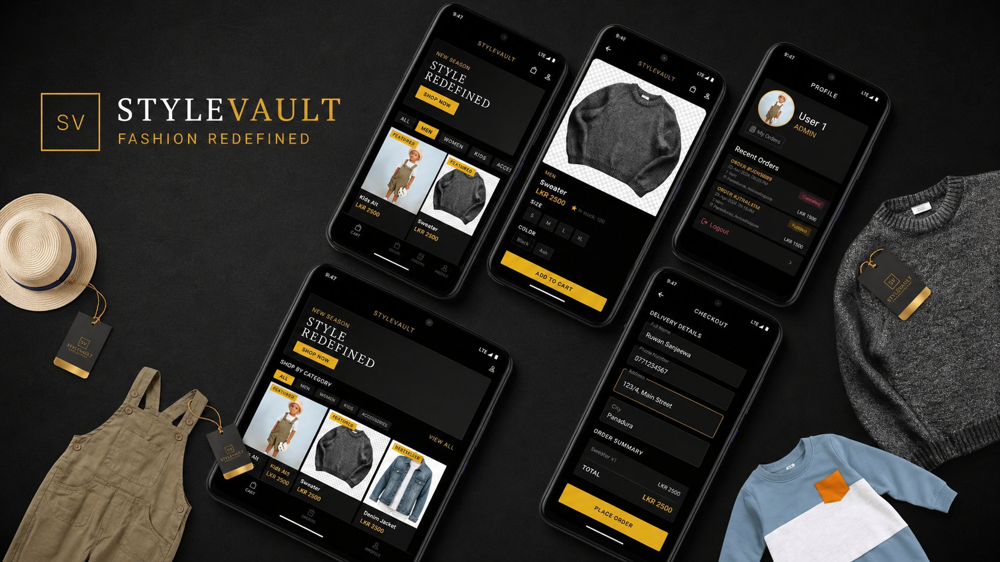

# 👑 StyleVault | Premium Fashion E-Commerce

<p align="center">
  
</p>

<p align="center">
  <a href="https://flutter.dev"></a>
  <a href="https://firebase.google.com"></a>
  <a href="https://dart.dev"></a>
  
</p>

---

## 📖 Project Overview

**StyleVault** is an elite, production-grade mobile commerce application engineered for the luxury fashion sector. Developed using **Flutter** and **Firebase**, it provides a seamless, high-performance shopping journey wrapped in a sophisticated "Luxury Noir" interface.

The system is built on an **MVVM (Model-View-ViewModel)** architecture, ensuring extreme modularity, easy testing, and the scalability required for modern retail environments.

---

##🛡️ Key Features & Engineering Excellence

   - 🔐 Identity & Security: Industrial-grade Firebase Auth implementation featuring persistent login sessions and Role-Based Access Control (RBAC) to distinguish between Customers and         Admins.
    
   - 🗄️ Real-time Synchronization: Reactive data layer utilizing Cloud Firestore snapshots for live inventory tracking and instant order status updates.
    
   - 👑 Premium UI/UX: A bespoke "Luxury Noir" design system. The deep-black aesthetic is paired with gold-accented Call-to-Action (CTA) elements to drive high conversion rates.
    
   - 📊 Integrated Admin Suite: A high-utility internal dashboard enabling real-time inventory adjustments, stock management, and order fulfillment tracking.
    
   - 🛒 Optimized Checkout: A frictionless, multi-step commerce flow featuring real-time order summaries, address validation, and secure state handling.
    
   - 🖼️ Media Optimization: High-fidelity image rendering powered by Cloudinary CDN integration with automated disk and memory caching for zero-latency browsing. 

---

## 🏗️ Technical Architecture & Directory Mapping

StyleVault follows a strict **Layered Feature Architecture** to decouple business logic from UI components:

```text
lib/
├── core/                  # Global Configs & Design System
│   ├── constants/         # App Colors (Onyx/Gold), Text Styles, & API Keys
│   └── router/            # Declarative routing via GoRouter with Guards
├── data/                  # Data Access Layer
│   ├── models/            # Data entities & JSON serialization logic
│   └── services/          # Firebase Auth, Firestore streams, & Seed logic
├── providers/             # ViewModel Layer (State Management)
│   └── providers.dart     # Reactive logic handling UI state
├── ui/                    # Presentation Layer
│   ├── screens/           # Feature views (Home, Cart, Profile, Admin)
│   ├── widgets/           # Atomic, reusable UI components
│   └── splash/            # Boot logic & session validation
└── main.dart              # Application entry & Provider initialization

```
---

## 🛠️ Technical Stack

| Layer | Technology |
| :--- | :--- |
| **Framework** | [Flutter](https://flutter.dev) (High-Performance Cross-Platform) |
| **State Management** | [Provider](https://pub.dev/packages/provider) (Clean MVVM Architecture) |
| **Navigation** | [GoRouter](https://pub.dev/packages/go_router) (Declarative Routing & Guards) |
| **Backend** | [Firebase](https://firebase.google.com) (Auth, Firestore, Storage) |
| **Database** | [Cloud Firestore](https://firebase.google.com/docs/firestore) (Real-time NoSQL) |
| **Cloud Media** | [Cloudinary](https://cloudinary.com) (Enterprise Image CDN) |

---

## 🎨💎 UI / UX Design

- 🖤 Dark luxury theme (deep black base)
- ✨ Gold accent styling
- 👠 High-end fashion editorial feel
- 📱 Smooth mobile-first experience
- 🎯 Clean and minimal navigation flow

---

## 🔐🛡️ Security & Data Flow

- Firebase Authentication for secure login sessions 🔐  
- Firestore security rules for data protection 🛡️  
- Service-based data handling layer ⚙️  
- Input validation on all forms ✔️  
- Scalable structure for future features 📈  

---


## ⚙️🚀 Getting Started
---
    Prerequisites
    
          Flutter SDK ^3.x.x
          Firebase CLI & Account
---
### 📥 Clone repository

```bash
git clone https://github.com/DevZenMaster/stylevault.git
cd stylevault
```


📦 Install dependencies
```
flutter pub get
```
▶️ Run application
```
flutter run
```
📦 Build APK
```
flutter build apk
```

##📌📊 Project Status
🚧 Active development
🧱 Core features under implementation
🏗️ Architecture prepared for scaling

##🎯💡 Goal

To build a scalable fashion commerce platform with strong architecture, secure backend integration, and a premium luxury shopping experience.

##👨‍💻 Dev

Ruwan Sanjeewa
DevZenMaster 👑


---

